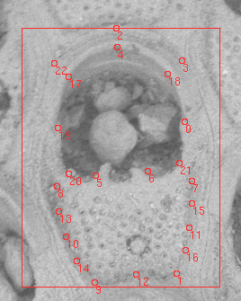
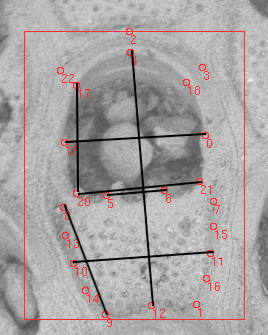

This repository is for the analysis of _Steginoporella magnifica_ images and traits.

# Images

The images are SEM images of _Steginoporella magnifica_ collected from New Zealand. These specimens are both modern and paleo (~2.3 Mya).

The images were collected by K. Voje, L.H. Liow, E. DiMartino, A. Piwoni-Piórewicz and others. The specimens were imaged by M. Ramsfjell.

Images are stored...

# Metadata

## Imaging metadata

The metadata file "[Imaged Steginoporella magnifica specimens.csv](https://github.com/megbalk/magnifica/blob/main/Imaged%20Steginoporella%20magnifica%20specimens.csv)" contains information about:
- date of image (Date) in MM/DD/YYY format
- a unique specimen number (specimenNR)
- number of pictures taken of the specimen (NR of pics)
- AV
- magnification
- formation
- comments

## Image protocol

There is also a file, "[Protocol Steginoporella magnifica.docx](https://github.com/megbalk/magnifica/blob/main/Protocol%20Steginoporella%20magnifica.docx)", containing information about the codes found in the metadata file.

## Location metadata

[Metadata for each formation](https://github.com/megbalk/stegino_metadata/blob/main/newMetadata/formations.csv) found in [Di Martino & Liow 2021](https://doi.org/10.1098/rspb.2020.2047).

# Traits

We extracted linear measurements from landmarks images of zooids.

## Landmarking

There are a total of 23 landmarks, numbered 0 to 22.

## Linear measurements

Linear measurements were extracted using the landmark coordinates.

*Traits*

- zooid height (zh; points 4 to 12) {#F8766D}
- operculum height (oh; calculated as hieght of triangle between points 4, 20, 21) {#CD9600}
- operculum width at the midline (ow.m; points 19 to 0) {#B79F00}
- operculum side length (o.side; calculated as average between 21 to 18 and 20 to 17) {#00BE67}
- median process width (mpw.b; point 5 to 6) {#00C094}
- cryptocyst width at distal end (cw.d; point 20 to 21) {#619CFF}
- cryptocyst width at midline (cw.m; points 10 to 11) {#00BFC4}
- cryptocyst side length (c.side; calculated as average between 1 to 7 and 9 to 8) {#C77CFF}

# Automation

A. Porto created [Steginator](https://github.com/agporto/Steginator), which links [DeepBryo](https://deepbryo.ngrok.io/), a tool developed by [DiMartino et al.](https://www.biorxiv.org/content/early/2022/11/17/2022.11.17.516938) that segments out zooids from a colony, and [ML-morph](https://github.com/agporto/ml-morph), a tool developed by [Porto & Voje](https://doi.org/10.1111/2041-210X.13373) to automatically place landmarks on images.

The output of the machine learning pipeline is a csv file of:
- id of the image (specimenNR_NR of pics_AV_magnification_backscatter)
- box_id, a unique identifier for the zooid in the image (box_top_box_left_box_width_box_height)
- box_top
- box_left
- box_width
- box_height
- Xn cooridnate, where n corresponds to the landmark number for landmarks 0-22
- Yn coordinate, where n corresponds to the landmark number for landmarks 0-22

# Data processing

In the code, "[fileNames.R](https://github.com/megbalk/magnifica/blob/main/fileNames.R)", reads in the image names and associated metadata file name and creates the dataset, "[imageList.csv](https://github.com/megbalk/magnifica/blob/main/imageList.csv)". This list retains information about the file structure, parses the image name into the same parts as the "Imaged Steginoporella magnifica specimens.csv", and notes the extension of the data item.

The code also checks for discrepencies being the imaging metadata, "Imaged Steginoporella magnifica specimens.csv", and the list of images.

# Exploratory analysis

The code, "[exploratoryAnalysis.R](https://github.com/megbalk/magnifica/blob/main/exploratoryAnalysis.R)", reads the file "[output.csv](https://github.com/megbalk/magnifica/blob/main/output.csv)", which is the output from the Steginator pipeline.

It extracts linear measurements using the landmark coordinates.
